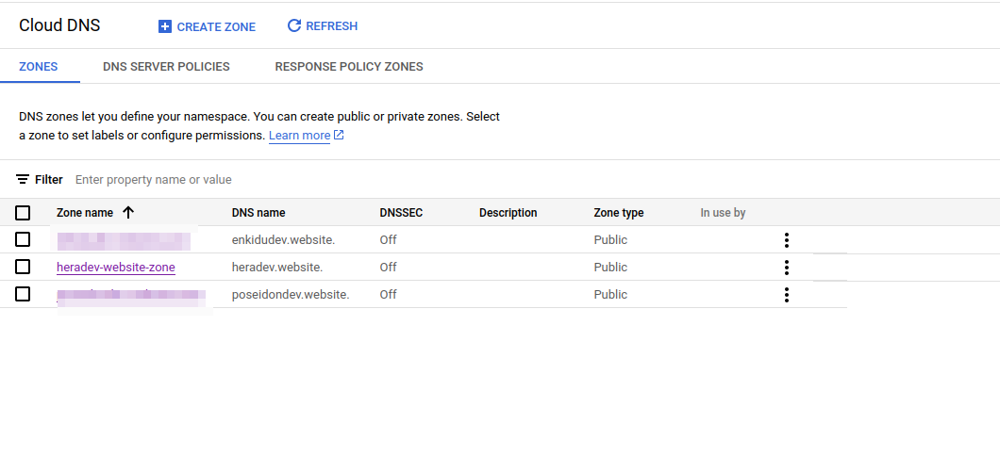

# GKE Cluster Setup with Cert Manager, NGINX Ingress, and External Secrets Operator (ESO)

This guide provides step-by-step instructions to create a GKE cluster and install Cert Manager, NGINX Ingress Controller, and External Secrets Operator (ESO) using Helm.

## Prerequisites

- Google Cloud SDK (`gcloud`)
- Kubernetes CLI (`kubectl`)
- Helm installed locally
- A Google Cloud Project with Kubernetes Engine API enabled

## Step 1: Create GKE Cluster

Use the following `gcloud` command to create a GKE cluster:

```bash
gcloud container clusters create my-cluster --zone us-central1-a --num-nodes=3
```

## Step 2: Install Cert Manager

Cert Manager automates the management and issuance of TLS certificates. To install Cert Manager with Helm:

```bash
# Add the Jetstack Helm repository (the maintainers of Cert Manager)
helm repo add jetstack https://charts.jetstack.io

# Update your Helm repo to ensure the latest charts are available
helm repo update

# Install Cert Manager into the cert-manager namespace
helm install cert-manager jetstack/cert-manager --namespace cert-manager --create-namespace --version v1.13.0 --set installCRDs=true
```

## Step 3: Install NGINX Ingress Controller

To install the NGINX Ingress controller using Helm:

```bash
# Add the ingress-nginx repository
helm repo add ingress-nginx https://kubernetes.github.io/ingress-nginx

# Update your Helm repo
helm repo update

# Install the NGINX Ingress controller into a dedicated namespace
helm install nginx-ingress ingress-nginx/ingress-nginx --namespace ingress-nginx --create-namespace
```

This will install the NGINX Ingress controller in the `ingress-nginx` namespace.

## Step 4: Install External Secrets Operator (ESO)

ESO integrates external secret management systems (like AWS Secrets Manager, Google Secrets Manager) with Kubernetes.

```bash
# Add the external-secrets repository
helm repo add external-secrets https://charts.external-secrets.io

# Update your Helm repo
helm repo update

# Install the External Secrets Operator into its own namespace
helm install external-secrets external-secrets/external-secrets --namespace external-secrets --create-namespace
```

## Step 5: Verify the Installations

### Cert Manager:
Check the Cert Manager pods and CRDs are installed and running:

```bash
kubectl get pods --namespace cert-manager
kubectl get crds | grep cert-manager
```

### NGINX Ingress:
Check that the NGINX Ingress controller is running:

```bash
kubectl get pods --namespace ingress-nginx
```

### External Secrets Operator:
Ensure the ESO pods are up and running:

```bash
kubectl get pods --namespace external-secrets
```

### Create Zone, A-record For Ingress-nginx Service and Change Nameservers: 



### Deploy Website With TLS Using HTTP-01 Chanllenge:
```
kubectl apply -f cluster-issuer.yaml
kubectl apply -f ingress.yaml
kubectl apply -f deployment.yml
kubectl apply -f service.yml
```

### Validate : 
 

 
 